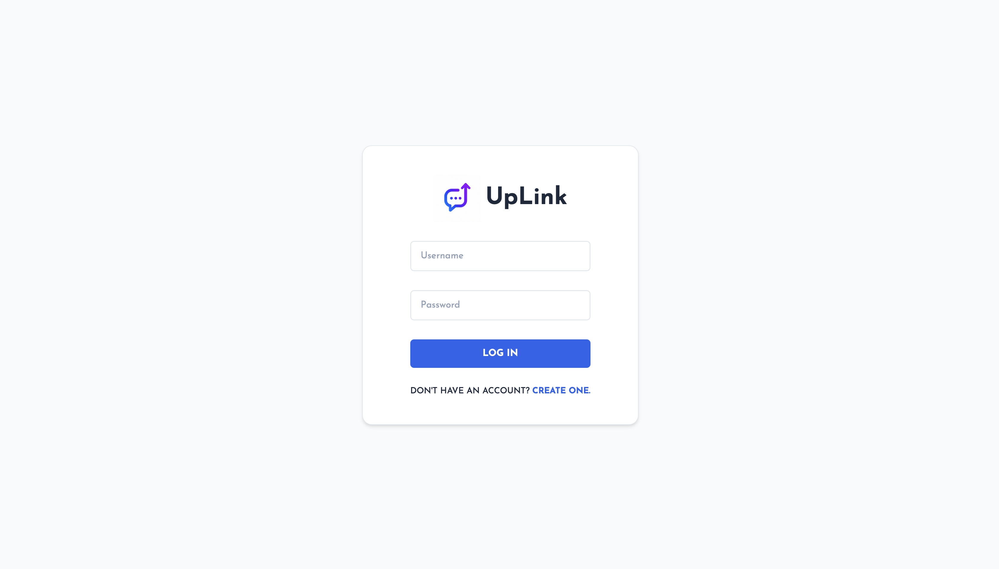
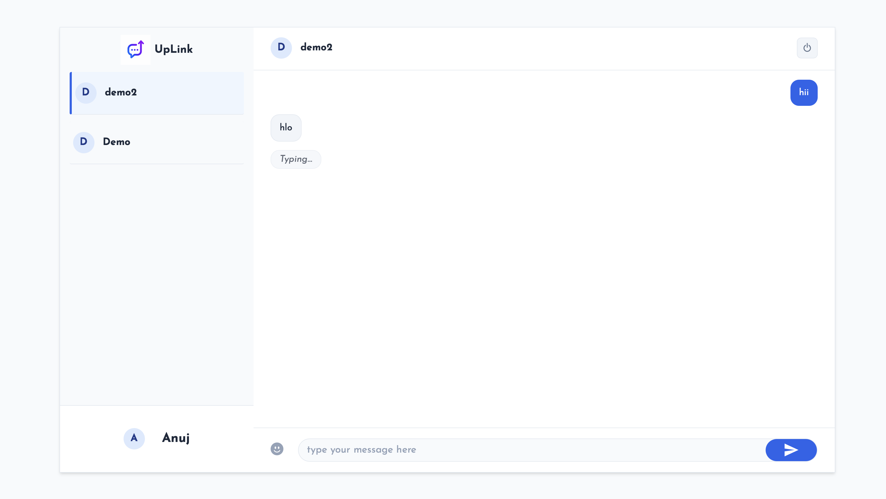

#  UpLink Chat

**[💬 Live Demo - UpLink](https://up-link-chat.vercel.app)**


UpLink is a full-stack, real-time messaging application built with the MERN stack. I built this project to dive deep into WebSocket architecture and implement specific algorithmic optimizations for handling chat data efficiently.

##  Application Gallery





## Features

* **Real-Time Messaging:** Bi-directional communication powered by `Socket.io`, configured to establish pure WebSocket connections (`wss://`) for minimal latency.
* **Infinite Scroll:** Loads historical messages dynamically as the user scrolls up the chat window.
* **Typing Indicators:** Real-time visual feedback when a connected user is typing.
* **Authentication:** Custom user registration and login flow with secure password hashing.
* **Responsive UI:** Built with React and Styled-Components to scale cleanly across desktop and mobile.

---

##  Technical Highlights

To move beyond standard CRUD operations, I implemented specific algorithmic optimizations to handle active conversations and history retrieval efficiently:

### 1. Splay Tree for Chat Caching
To optimize the retrieval of frequently accessed active conversations, recent chats are managed using a **Splay Tree**. 
* By exploiting temporal locality, whenever a chat receives a new message or is opened, that node is "splayed" to the root. 
* While standard operations maintain an **O(log n) amortized time complexity**, keeping the most active conversations near the root significantly reduces search depth and lookup times compared to standard linear arrays or static trees.

### 2. Cursor-Based Pagination
Standard offset pagination (using `limit` and `skip`) requires the database to scan over skipped items, resulting in degraded performance as a chat history grows. UpLink utilizes cursor-based pagination, fetching older messages using an indexed timestamp (`$lt`). This completely bypasses the O(N) scanning penalty, keeping query times consistently fast regardless of how deep into a conversation the user scrolls.

---

##🛠️ Tech Stack

* **Frontend:** React.js, Axios, Socket.io-client, Styled-Components
* **Backend:** Node.js, Express.js, MongoDB Atlas, Mongoose
* **Deployment Infrastructure:** Vercel (Frontend CI/CD) & Render (Backend API)

---

## Local Development Setup

If you want to run this application locally, follow these steps:

### 1. Clone the repository
```bash
git clone [https://github.com/Ashu-ops18/UpLink-Chat.git](https://github.com/Ashu-ops18/UpLink-Chat.git)
cd UpLink-Chat
```
### 2. Install Dependencies
```bash
# Install backend dependencies
cd server
npm install

# Install frontend dependencies
cd ../public
npm install
```
### 3. Environment Variables
```bash
# In /server/.env:
PORT=5000
MONGO_URL=your_mongodb_atlas_connection_string


# In /public/.env:
REACT_APP_BACKEND_URL=http://localhost:5000
REACT_APP_LOCALHOST_KEY=chat-app-current-user
```
### 3. Run the Application
```bash
Open two separate terminal windows:

Terminal 1 (Backend Server):
cd server
npm start

Terminal 2 (React Frontend):
cd public
npm start
```

Architected and developed by Ashish Kumar.